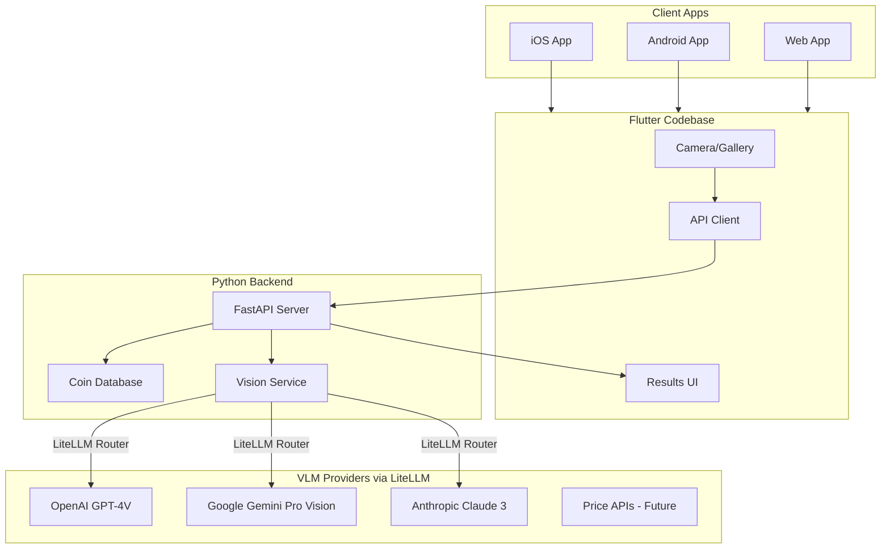

# CoinScope - Coin Identification App

## Architecture Overview



## Tech Stack

| Layer | Technology | Rationale |

|-------|------------|-----------|

| Frontend | Flutter 3.x + Dart | Single codebase for iOS, Android, Web |

| Backend | Python 3.11 + FastAPI | Fast async API, excellent for AI integration |

| VLM Router | LiteLLM | Unified API for 100+ LLMs, easy provider switching |

| VLM Providers | GPT-4V, Gemini Pro Vision, Claude 3 | Multiple options for cost/quality tradeoffs |

| Database | SQLite (dev) / PostgreSQL (prod) | Coin reference data and scan history |

| Image Storage | Local filesystem / S3 (future) | Store uploaded coin images |

## MVP Features (Phase 1)

1. **Photo Capture**: Take a photo or select from gallery
2. **Single/Multi-Coin Detection**: Identify one or multiple coins in a single image
3. **Coin Information Display**: Show country, year, denomination, and coin name
4. **Scan History**: Local storage of recent scans (no account needed)

## Project Structure

```javascript
coinscope/
├── frontend/                    # Flutter app
│   ├── lib/
│   │   ├── main.dart
│   │   ├── screens/
│   │   │   ├── home_screen.dart
│   │   │   ├── camera_screen.dart
│   │   │   └── results_screen.dart
│   │   ├── models/
│   │   │   └── coin.dart
│   │   ├── services/
│   │   │   ├── api_service.dart
│   │   │   └── camera_service.dart
│   │   └── widgets/
│   │       └── coin_card.dart
│   ├── pubspec.yaml
│   └── web/, ios/, android/
│
├── backend/                     # Python API
│   ├── app/
│   │   ├── main.py              # FastAPI app entry
│   │   ├── routers/
│   │   │   └── coins.py         # Coin identification endpoints
│   │   ├── services/
│   │   │   └── vlm_service.py    # LiteLLM multi-provider VLM integration
│   │   ├── models/
│   │   │   └── coin.py          # Pydantic models
│   │   └── database/
│   │       └── coin_db.py       # Coin reference data
│   ├── requirements.txt
│   └── .env.example
│
└── README.md
```

## API Design

### POST /api/v1/coins/identify

Accepts an image and returns identified coins.**Request:**

```javascript
Content-Type: multipart/form-data
Body: image file (JPEG/PNG)
```

**Response:**

```json
{
  "coins": [
    {
      "id": "uuid",
      "name": "Lincoln Penny",
      "country": "United States",
      "year": 1982,
      "denomination": "1 cent",
      "face_value": 0.01,
      "currency": "USD",
      "obverse_description": "Abraham Lincoln portrait",
      "reverse_description": "Lincoln Memorial",
      "confidence": 0.92
    }
  ],
  "total_coins_detected": 1
}
```

## VLM Prompt Strategy

The backend uses LiteLLM to route requests to configurable VLM providers. LiteLLM provides a unified OpenAI-compatible API that works with GPT-4V, Gemini Pro Vision, Claude 3, and 100+ other models. Switch providers by changing a single environment variable.

**Supported Providers:**

- `gpt-4-vision-preview` - OpenAI GPT-4 Vision
- `gemini/gemini-1.5-pro` - Google Gemini Pro Vision  
- `claude-3-opus-20240229` - Anthropic Claude 3 Opus
- `claude-3-sonnet-20240229` - Anthropic Claude 3 Sonnet

The backend sends a structured prompt to the configured VLM:

```javascript
Analyze this image of coin(s). For each coin visible, provide:
1. Country of origin
2. Year minted (if visible)
3. Face value/denomination
4. Name of the coin (e.g., "Quarter", "Euro", "Pound")
5. Brief description of obverse (front) and reverse (back) if visible

Return as JSON array. If year is not visible, estimate based on design.
```

## Implementation Phases

### Phase 1: MVP (Current Scope)

- Basic Flutter app with camera integration
- FastAPI backend with LiteLLM for multi-provider VLM support
- Coin identification with core attributes
- Simple results display UI

### Phase 2: Enhanced Data (Future)

- Coin pricing integration (eBay API, Numista)
- Related seller links
- More detailed coin specifications

### Phase 3: User Features (Future)

- User authentication
- Personal coin collections
- Scan history sync across devices
- Social sharing

## Key Dependencies

**Flutter (pubspec.yaml):**

- `camera` - Camera access
- `image_picker` - Gallery selection
- `http` - API calls
- `shared_preferences` - Local storage

**Python (requirements.txt):**

- `fastapi` - Web framework
- `uvicorn` - ASGI server
- `litellm` - Unified LLM/VLM API (supports GPT-4V, Gemini, Claude, etc.)
- `python-multipart` - File uploads
- `pydantic` - Data validation
- `python-dotenv` - Environment configuration

## Development Setup

1. Create Flutter project with web support enabled
2. Set up FastAPI backend with virtual environment
3. Configure VLM provider API keys in `.env` (supports multiple providers)
4. Set `VLM_MODEL` environment variable to choose provider (e.g., `gpt-4-vision-preview`, `gemini/gemini-1.5-pro`)
5. Run backend locally, point Flutter app to localhost

## LiteLLM Configuration

```python
# Example: Switch VLM provider via environment variable
import litellm
import os

model = os.getenv("VLM_MODEL", "gpt-4-vision-preview")

response = litellm.completion(
    model=model,
    messages=[{
        "role": "user",
        "content": [
            {"type": "text", "text": "Identify this coin..."},
            {"type": "image_url", "image_url": {"url": f"data:image/jpeg;base64,{image_b64}"}}
        ]
    }]
)
```

**Environment Variables (.env):**

```
VLM_MODEL=gpt-4-vision-preview
OPENAI_API_KEY=sk-...
GEMINI_API_KEY=...
ANTHROPIC_API_KEY=...
```